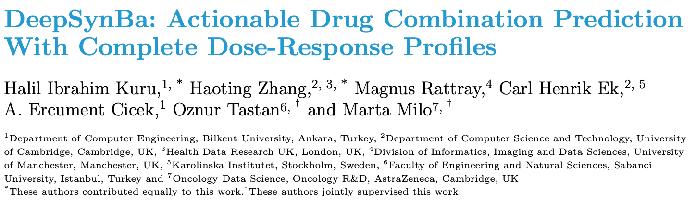
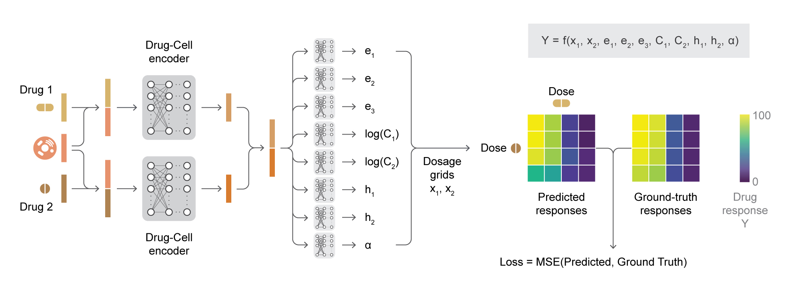

Many cancer monotherapies demonstrate limited clinical efficacy, making combination therapies a
relevant treatment strategy. The extensive number of potential drug combinations and context-specific response profiles
complicates the prediction of drug combination responses. Existing computational models are typically trained to predict
a single aggregated synergy score, which summarises drug responses across different dosage combinations, such as Bliss
or Loewe scores. This oversimplification of the drug-response surface leads to high prediction uncertainty and limited
actionability because these models fail to differentiate between potency and efficacy. Drug safety could be compromised
because of the models’ inability to quantify potency in combination regimes.

We introduce DeepSynBa, an actionable model that predicts the complete dose-response matrix of drug pairs
instead of relying on an aggregated synergy score. This is achieved by predicting parameters describing the response surface
as an intermediate layer in the model. We evaluated DeepSynBa on the NCI-ALMANAC dataset, which comprises nearly
300,000 drug pair–cell line combinations. DeepSynBa outperforms the state-of-the-art methods in the dose-response
matrix prediction task across multiple evaluation scenarios, including testing on novel drug combinations, cell lines, and
drugs, across nine different tissue types. We also show that DeepSynBa yields reliable synergy score predictions. More
importantly, DeepSynBa can predict drug combination responses across different dosages for untested combinations. The
intermediate dose-response parameter layer allows for separating efficacy from potency, which informs the selection of
dosage ranges that optimise efficacy while limiting off-target toxicity in experimental screens. The predictive capability
and the downstream actionability make DeepSynBa a powerful tool for advancing drug combination research beyond the
limitations of the current approaches

---
## DeepSynba Architecture

DeepSynBA is designed to predict the effects of drug combinations on cell 
lines by incorporating both drug and cell line features. Each drug combination consists of two drugs applied to a single cell
line, and the model includes two dedicated drug-cell encoder sub-networks. Each encoder focuses on fusing the properties
of one drug with the gene expression profiles of the cell line, enabling a detailed capture of interactions between the drugs
and the cellular gene expression profiles.

The model uses feature representations for drugs (d<sub>i</sub> and d<sub>j</sub> ) and cell lines (c<sub>k</sub>). Drug features are generated
as vector embeddings from the MoLFormer model [Ross et al., 2022], and the cell line features are represented by
vectors of untreated gene expression data. These features are concatenated into a combined vector ([d<sub>i</sub>; c<sub>k</sub>] or [d<sub>j</sub> ; <sub>ck</sub>]) and
then processed through a series of fully connected layers. These layers transform the combined drug-cell line features into a
comprehensive representation that captures the interactions between the drugs and the cell line. The outputs of the drug-
cell encoders are drug-induced gene expression feature maps, which encapsulate the interaction between each drug and the
cell line at a molecular level. The feature maps from each of the encoders are then concatenated to produce a unified
representation, effectively summarising the combined impact of both drugs on the cell line.

Subsequently, the unified representation is inputted into eight distinct prediction heads, each corresponding to one
parameter in the SynBa likelihood function [Zhang et al., 2023]. Each prediction head comprises fully connected layers that
process the unified representation to predict a single scalar value for each parameter. By using these prediction heads, the
model can estimate the SynBa parameters accurately. The SynBa parameters are then used to generate the complete dose-response matrix for the drug combination on the cell line. The model is trained end-to-end using the SynBa likelihood function
as the loss function, which enables the model to learn the optimal parameters for predicting the dose-response matrix.

---
## Installation
To install the required packages, run the following command:
```bash
pip install -r requirements.txt
```

---
## Data
The pre-processed NCI-ALMANAC dataset, drug and cell line features, and the train-test split are available in `data.zip` file. 
To use the dataset for training and evaluation of the DeepSynBa model, 
please unzip into the `data` directory.
The dataset consists of nearly 300,000 drug pair–cell line combinations, where each combination is associated with a dose-response matrix. 
The dataset is split into training, validation, and test sets, with 60%, 20%, and 20% of the data in each set, respectively.

---
## Training
To train the DeepSynBa model, run the following command:
```bash
python train.py --config_path <path_to_config>
```
The `--config_path` argument specifies config file of the model, which provides all required parameters for the training, 
The training script will train the DeepSynBa model on the NCI-ALMANAC dataset 
and save the model checkpoints and logs in the specified output directory in the config file.

---
## Evaluation
To evaluate the DeepSynBa model, run the following command:
```bash
python evaluate.py --checkpoint_path <path_to_model>
```
The `--checkpoint_path` argument specifies the path to the trained DeepSynBa model

---
## Results
The DeepSynBa model outperforms the state-of-the-art methods in the dose-response matrix prediction task across multiple evaluation scenarios, 
including testing on novel drug combinations, cell lines, and drugs, across nine different tissue types. 
The model yields reliable synergy score predictions and can predict drug combination responses across different dosages for untested combinations. 
The intermediate dose-response parameter layer allows for separating efficacy from potency, 
which informs the selection of dosage ranges that optimise efficacy while limiting off-target toxicity in experimental screens. 
The predictive capability and the downstream actionability make DeepSynBa a powerful tool for 
advancing drug combination research beyond the limitations of the current approaches. 
Table 1 shows the performance comparison of DeepSynBa with the state-of-the-art methods on the NCI-ALMANAC dataset. 
The results demonstrate that DeepSynBa outperforms the existing methods in predicting the dose-response matrix and synergy scores across multiple evaluation scenarios. 
The model achieves superior performance in terms of the root mean squared error (RMSE), Pearson and Spearman correlation coefficients 
for the dose-response matrix prediction task and the synergy score prediction task. 
The results indicate that DeepSynBa can accurately predict the effects of drug combinations on cell lines and provide actionable insights for drug combination research.

#### Table 1: Performance comparison of DeepSynBa with the state-of-the-art methods on the NCI-ALMANAC dataset


<table>
<tr><th>New Drug Combination</th><th>New Cell Line</th><th>New Drug</th></tr>
<tr><td>

|               | **RMSE** | **Pearson**   | **Spearman** |
|---------------|----------|---------------|--------------|
| **comboFM**   | 12.76    | 0.87          | 0.68         |
| **comboLTR**  | 16.11    | 0.78          | 0.64         |
| **DeepSynBa** | **7.72** | **0.95**      | **0.82**     |

</td>
<td>

|               | **RMSE**  | **Pearson** | **Spearman** |
|---------------|-----------|-------------|--------------|
| **comboFM**   | 12.86     | 0.87        | 0.69         |
| **comboLTR**  | 15.23     | 0.81        | 0.67         |
| **DeepSynBa** | **7.71**  | **0.95**    | **0.82**     |

</td>
<td>

|               | **RMSE**  | **Pearson** | **Spearman** |
|---------------|-----------|-------------|--------------|
| **comboFM**   | 42.39     | 0.35        | 0.24         |
| **comboLTR**  | 40.22     | 0.40        | 0.40         |
| **DeepSynBa** | **18.69** | **0.71**    | **0.64**     |
</td>
</tr> 
</table>

## References
- **[Ross et al., 2022]** Ross, Jerret, et al. "Large-scale chemical language representations capture molecular structure and properties." Nature Machine Intelligence 4.12 (2022): 1256-1264.
- **[Zhang et al., 2023]** Zhang, Haoting, et al. "SynBa: improved estimation of drug combination synergies with uncertainty quantification." Bioinformatics 39.Supplement_1 (2023): i121-i130.

## License

- **[CC BY-NC-SA 4.0](https://creativecommons.org/licenses/by-nc-sa/4.0/)**